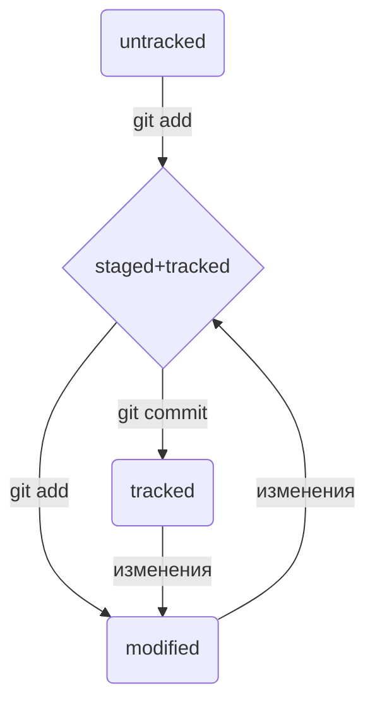
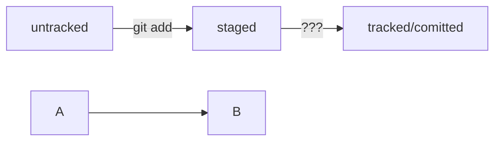

## Шпаргалка №1
### Навигация
* *pwd* (от англ. print working directory, "показать рабочую папку") -- покажи, в какой я папке
* *ls* (от англ. list directory contents, "отобразить содержимое директории") -- покажи файлы и папки в текущей папке
* *ls -a* -- покади также скрытые файлы и папки, названия которых начинаются с символа *.*
* *cd first-project/html* -- перейди в папку *html*, которая находится в папке *first-project*
* *cd ..* -- перейди на уровень выше, в родительскую папку
* *cd ~* -- перейди в домашнюю директорию (/Users/Username)
* *cd /* -- перейди в корневую директорию

### Работа с файлами и папками
* *touch index.html* (англ. touch, "коснуться") -- создать файл *index.html* в текущей папке
```
$ touch my-new-file.txt #создали файл my-new-file.txt
```
* *touch index.html style.css script.js* -- если нужно создать сразу несколько файлов, можно напечатать их имена в одну строку через пробел
* *mkdir second-project* (от англ. make directory, "создать директорию") -- создай папку с именем *second-project* в текущей папке
```
$ mkdir new-dir #создали директорию new-dir
```
```
$ mkdir -p dir1/dir-inside/dir-deeper-inside #создали папку dir-deeper-inside в папке dir-inside, которая находится в папке dir1
#Также можно использовать обе команды вместе с символом домашней директории (~) или родительской директории (..).
```
* *cp* (копировать файл)
```
$ cp что_копируем куда_копируем
```
```
$ cp index.html src/ #скопировали index.html в папку src
```

### Копирование и перемещение 
* *p file.txt ~/my-dir* (от англ. copy, "копировать") -- скопируй файл в другое место
* *mv file.txt ~/my-dir* (от англ. move, "переместить") -- перемести файл или папку в другое место

### Чтение
* *cat file.txt* (от англ. concatenate and print, "объединить и распечатать") -- распечатай содержимое файла *file.txt*
Команда напечатает, что содержится в открываемом файле
Команда cat работает только с текстовыми файлами. Вывести этой командой файл другого типа (например, изображение) не получится.

### Удаление
* *rm about.html* (от англ. remove, "удалить") -- удали файл *about.html*
```
$ rm example.txt удалили файл example.txt из текущей папки
```
* *rmdir images* (от англ. remove directory, "удали директорию") -- удали папку *images*
* *rm -r second-project* (от англ. remove, "удалить" + recursive, "рекурсивный") -- удали папку *second-project* и все, что она содержит

### Полезные возможности
* Команды необязательно печатать и выполнять по очереди. Можно указать их списком -- разделить двумя амперсандами (*&&*)
* У консоли есть собственная память -- буфер с несколькими последними командами. По ним можно перемещаться с помощью клавиш со стрелками вверх\вниз
* Чтобы не вводить название файла или папки полностью, можно набрать первые символы имени дважды нажать *TAB*. Если файл или папка есть в директории, командная строка допишет путь сама
* Например, вы находитесь в папке *dev*. Начните вводить *cd first* и дважды нажмите *TAB*. Если папка *first-project* есть внутри *dev*, командная строка автоматически подставит ее имя. Останется только нажать *Enter*

---

## Шпаргалка №2. Начало работы с Git

### Инициализация репозитория
**git init** (от англ. initialize, «инициализировать») — инициализируй репозиторий.

### Синхронизация локального и удалённого репозиториев
**git remote add origin** https://github.com/YandexPracticum/first-project.git (от англ. remote, «удалённый» + add, «добавить») — привяжи локальный репозиторий к удалённому с URL https://github.com/YandexPracticum/first-project.git;
**git remote -v** (от англ. verbose, «подробный») — проверь, что репозитории действительно связались;
**git push -u origin main** (от англ. push, «толкать») — в первый раз загрузи все коммиты из локального репозитория в удалённый с названием origin.

*Ваша ветка может называться master, а не main. Подправьте команду, если это необходимо.*

**git push** (от англ. push, «толкать») — загрузи коммиты в удалённый репозиторий после того, как он был привязан с помощью флага -u.

### Подготовка файла к коммиту
**git add todo.txt** (от англ. add, «добавить») — подготовь файл todo.txt к коммиту;
**git add --all** (от англ. add, «добавить» + all, «всё») — подготовь к коммиту сразу все файлы, в которых были изменения, и все новые файлы;
**git add** . — подготовь к коммиту текущую папку и все файлы в ней.

### Создание и публикация коммита
**git commit -m** "Комментарий к коммиту." (от англ. commit, «совершать», фиксировать» + message, «сообщение») — сделай коммит и оставь комментарий, чтобы было проще понять, какие изменения сделаны;
**git push** (от англ. push, «толкать») — добавь изменения в удалённый репозиторий.

### Просмотр информации о коммитах
**git log** (от англ. log, «журнал [записей]») — выведи подробную историю коммитов;
**git log --oneline** (от англ. log, «журнал [записей]» + oneline, «одной строкой») — покажи краткую информацию о коммитах: сокращённый хеш и сообщение.

### Просмотр состояния файлов
**git status** (от англ. status, «статус», «состояние») — покажи текущее состояние репозитория.

### Добавление изменений в последний коммит
**git commit --amend --no-edit** (от англ. amend, «исправить») — добавь изменения к последнему коммиту и оставь сообщение прежним;
**git commit --amend -m "Новое сообщение"** — измени сообщение к последнему коммиту на Новое сообщение.

*Выйти из редактора Vim: нажать Esc, ввести :qa!, нажать Enter.*

### «Откат» файлов и коммитов
**git restore --staged hello.txt** (от англ. restore, «восстановить») — переведи файл hello.txt из состояния staged обратно в untracked или modified;
**git restore hello.txt** — верни файл hello.txt к последней версии, которая была сохранена через git commit или git add;
**git reset --hard b576d89** (от англ. reset, «сброс», «обнуление» + hard, «суровый») — удали все незакоммиченные изменения из staging и «рабочей зоны» вплоть до указанного коммита.

### Просмотр изменений
**git diff** (от англ. difference, «отличие», «разница») — покажи изменения в «рабочей зоне», то есть в modified-файлах;
**git diff _a9928ab 11bada1_** — выведи разницу между двумя коммитами;
**git diff --staged** — покажи изменения, которые добавлены в staged-файлах.

---

```
$ rmdir images #команда удалит папку images из текущей директории, 
               #если папка images пуста
$ rm -r images #удалили папку images со всем её содержимым из текущей директории
```
В этом случае команда rm -r (-r — от англ. recursive, «рекурсивный») рекурсивно удаляет файлы и папки. Это значит, что удаление будет последовательно применяться к каждому из элементов в этой папке — пока не сотрёт их все. Затем команда удалит пустую директорию.

Команды в терминале необязательно вбивать и выполнять по очереди. Их можно указывать не по одной, а сразу списком. Для этого их нужно разделить двумя амперсандами (&&).

---

```
git config –global #(изменение инфо файла с именем почтой)
```
```
$ git config --global user.name "User Namovich"
```
имя или ник нужно написать латиницей и в кавычках
```
$ git config --global user.email username@yandex.ru
```
здесь нужно указать свой настоящий email
```
$ git config –list
```
*Сделать папку репозиторием — git init*
```
$ cd ~/dev/first-project #перешли в нужную папку
$ git init #создали репозиторий
```
«Разгитить» папку, если что-то пошло не так, *— rm -rf .git*

*Проверить состояние репозитория — git status*

#### Команда git status выведет:
* название текущей ветки: On branch master или On branch main;
* сообщение о том, что в репозитории ещё нет коммитов: No commits yet;
* сообщение, которое говорит: «чтобы что-нибудь закоммитить (то есть зафиксировать), нужно сначала это создать» — nothing to commit (create/copy files and use "git add" to track).

*Подготовить файлы к сохранению — git add*

Для отслеживания состояния всех файлов: 
```
$ git add --all #(от англ. add — «добавить» + от англ. all — «всё»). Ключ, или флаг, --all позволяет подготовить к сохранению все файлы в репозитории.
$ git add --all #подготовили к сохранению все файлы в репозитории
$ git status #проверили статус
$ git add todo.txt
$ git add readme.txt
$ git status
```
Также можно добавить текущую папку целиком — в этом случае все файлы в ней тоже будут добавлены. Обратиться к текущей папке в Bash позволяет точка (.).

```
$ git add . #добавить всю текущую папку
$ git status 
```

*«Сделать коммит» значит сохранить текущую версию файла.*

Сделать коммит можно командой git commit c ключом -m (от англ. message — «сообщение»), который присваивает коммиту сообщение.
Ещё раз о разнице между git add и git commit
Сначала команда git add сообщает Git, какие именно файлы нужно сохранить и какую их версию. Затем с помощью команды git commit происходит само сохранение. 

*Просмотреть историю коммитов — git log*

```
$ ls -la .ssh/ #вывели список созданных ключей
$ ssh-keygen -t ed25519 -C "электронная почта, к которой привязан ваш аккаунт на GitHub"
$ ssh-keygen -t rsa -b 4096 -C "электронная почта, к которой привязан ваш аккаунт на GitHub"
ls -a ~/.ssh
```

---

скопировать содержимое ключа в буфер обмена:
```
$ clip < ~/.ssh/id_rsa.pub
для ed25519:
$ clip < ~/.ssh/id_ed25519.pub
```

---

*Создать репозиторий на github.com с полностью таким же названием, как и у локального репозитория*

*Привязать удалённый репозиторий к локальному — git remote add*
```
$ git remote add origin git@github.com:%ИМЯ_АККАУНТА%/first-project.git
```
origin (англ. «источник») — стандартный псевдоним, с помощью которого можно обращаться к главному удалённому репозиторию (обычно такой репозиторий один). Это значительно упрощает работу.

*Убедиться, что репозитории связаны, — git remote -v*

*Отправить изменения на удалённый репозиторий — git push*

```
$ git push -u origin main #Если команда приведёт к ошибке, попробуйте заменить main на master.
```
В дальнейшем при работе с удалённым репозиторием флаг -u можно опустить и писать просто git push.

---

## Как создать и оформить README.md

README.md — текстовый файл, который можно создать командой touch, а затем редактировать так же, как и любой другой текстовый документ. Например, в блокноте.
Маркда́ун — это специальный язык разметки. Он позволяет красиво отформатировать текстовый документ.
* Заголовки разных уровней создают решётками.
# H1 — заголовок первого уровня, самый большой
## H2 — заголовок второго уровня, поменьше
### H3
#### H4
##### H5
###### H6 — заголовок шестого уровня, самый маленький

#### Заголовок 4
* Можно добавить черту под заголовком или абзацем.
Текст над чертой

---

Текст под чертой
* Чтобы сделать разрыв строки, нужно поставить два пробела (в примере ниже они обозначены точками ⋅⋅) или сочетание символов <br>.
* Чтобы начать новый параграф, в конце предыдущей строки должно стоять два символа переноса. Для этого нужно нажать Enter два раза.
Если сделать один перенос строки, как в примере ниже, и не поставить два пробела, текст сольётся в одну строку.
* Чтобы выделить текст курсивом (*текст*), его заключают в звёздочки (астериски) или нижние подчёркивания.
* Чтобы выделить текст полужирным шрифтом (**текст**), его окружают двойными звёздочками или двойными нижними подчёркиваниями.
* Чтобы зачеркнуть текст (~~текст~~), его окружают двойными волнистыми линиями — тильдами.

* Для оформления нумерованного списка достаточно поставить в начало строки цифры с точкой.
* Ненумерованный список создаётся звёздочкой с пробелом в начале строки либо дефисом с пробелом.

* Чтобы сделать ссылкой часть текста, его заключают в квадратные скобки, а затем указывают нужный адрес в круглых скобках.
* Также можно добавить ссылке тайтл (от англ title — «название», «заголовок»). Тайтл — это всплывающая подсказка, которая появляется при наведении мыши на ссылку. Тайтл нужно заключить в кавычки и указать внутри скобок после адреса.

Чтобы оформить текст как код, нужно окружить его тройками косых кавычек — грависов. После первой тройки грависов указывают язык программирования, на котором написан код. В маркдауне есть поддержка синтаксиса почти всех популярных языков и инструментов. 
```bash
ls - la
```
```html
<h1>А я просто текст</h1>
```
Обратите внимание: вторая тройка тройных кавычек стоит на отдельной строке.

---

## Хеш — идентификатор коммита
Хеширование (от англ. hash, «рубить», «крошить», «мешанина») — это способ преобразовать набор данных и получить их «отпечаток» (англ. fingerprint).
Git хеширует (преобразует) информацию о коммите с помощью алгоритма SHA-1 (от англ. Secure Hash Algorithm — «безопасный алгоритм хеширования») и получает для каждого коммита свой уникальный хеш — результат хеширования.
* Обычно хеш — это короткая (4040 символов в случае SHA-1) строка, которая состоит из цифр 0—90—9 и латинских букв A—F (неважно, заглавных или строчных). Она обладает следующими важными свойствами:
* если хеш получить дважды для одного и того же набора входных данных, то результат будет гарантированно одинаковый;
* если хоть что-то в исходных данных поменяется (хотя бы один символ), то хеш тоже изменится (причём сильно).

* Git преобразует информацию о коммитах с помощью алгоритма SHA-1 и для каждого из них рассчитывает уникальный идентификатор — хеш.
* Хеш — основной идентификатор коммита и позволяет узнать его автора, дату и содержимое закоммиченных файлов.
* Все хеши, а также таблицу соответствий хеш → информация о коммите Git хранит в папке .git.

---

*Получить сокращённый лог — git log --oneline*
Обратите внимание: если выход из просмотра логов не произошёл автоматически, нажмите клавишу Q (от англ. Quit — «выйти») в английской раскладке клавиатуры.

---

## Статусы untracked/tracked, staged и modified
* untracked (англ. «неотслеживаемый») 
Мы говорили, что новые файлы в Git-репозитории помечаются как untracked, то есть неотслеживаемые. Git «видит», что такой файл существует, но не следит за изменениями в нём. У untracked-файла нет предыдущих версий, зафиксированных в коммитах или через команду git add. 
* staged (англ. «подготовленный»)
После выполнения команды git add файл попадает в staging area (от англ. stage — «сцена», «этап [процесса]» и area — «область»), то есть в список файлов, которые войдут в коммит. В этот момент файл находится в состоянии staged.
В одном из предыдущих уроков мы сравнили коммит с фотографией. Можно развить эту аналогию и сказать, что команда git add добавляет персонажей (текущее содержимое файла или нескольких файлов) на сцену (англ. stage) для общей фотографии, а git commit делает снимок всей сцены целиком. 

#### Staging area, index и cache
Staging area также называют index (англ. «каталог») или cache (англ. «кеш»), а состояние файла staged иногда называют indexed или cached.
Все три варианта могут встречаться в документации и в качестве флагов команд Git. А также в интернете — например, в вопросах и ответах на сайте Stack Overflow.

#### Для файлов в состояниях staged и modified обычно не указывают, что они также tracked, потому что это состояние подразумевается.

Схема изменения состояний


---

### Пример обычного графа(`mermaid не забыть)

graph LR;
  untracked -- "git add" --> staged;
  staged    -- "???"     --> tracked/comitted;

%% стрелка без текста для примера: 
  A --> B;


---

## Какие состояния показывает git status
Большинство файлов в типичном проекте будут находиться в состоянии tracked (то есть закоммичены и не изменены после коммита). Вы не увидите это состояние в выводе команды git status — иначе она бы каждый раз выводила список вообще всех файлов проекта.
В итоге git status показывает только следующие состояния файлов:
* staged (Changes to be committed в выводе git status);
* modified (Changes not staged for commit);
* untracked (Untracked files).

##### Типичные варианты вывода git status
1. Нет ни staged-, ни modified-, ни untracked-файлов.
```
$ git status
On branch master
nothing to commit, working tree clean
```
2. Найдены неотслеживаемые файлы.
```
$ touch fileA.txt
$ git status
On branch master
Untracked files: #найдены неотслеживаемые файлы
  (use "git add <file>..." to include in what will be committed)
        fileA.txt

nothing added to commit but untracked files present (use "git add" to track)
```
Файл fileA.txt отображается в секции неотслеживаемых файлов — Untracked files. Это значит, что он не был добавлен в репозиторий через git add.
Теперь fileA.txt находится в секции Changes to be committed (англ. «изменения, которые попадут в коммит»). Если сейчас выполнить коммит, то в репозитории будет зафиксирована текущая версия этого файла. Закоммитьте его.
```
$ git commit -m 'Добавить файл fileA.txt'
```

тут будет вывод комманды commit, он нас не интересует
```
$ git status
On branch master
nothing to commit, working tree clean
```
3.	Найдены изменения, которые не войдут в коммит
внесли в fileA.txt правки
запросили статус
```
$ git status
On branch master
8Changes not staged for commit: #ещё одна секция
  (use "git add <file>..." to update what will be committed)
  (use "git restore <file>..." to discard changes in working directory)
        modified:   fileA.txt
```
Файл fileA.txt был изменён, но ещё не добавлен в staging area после этого. Так он оказался в секции Changes not staged for commit (англ. «изменения, которые не подготовлены к коммиту»). Эта секция соответствует статусу modified.
```
$ git add fileA.txt
$ git status
On branch master
Changes to be committed: #все изменения готовы к коммиту
  (use "git restore --staged <file>..." to unstage)
        modified:   fileA.txt
```
Обратите внимание: хотя вывод команды git status очень похож на тот, который был после первого добавления файла fileA.txt, они всё же отличаются.
Когда совсем новый файл попадает в staging area, перед его названием указывается new file. Вот так: new file: fileA.txt.
Если файл уже однажды попадал в историю (с помощью коммита) и был изменён, после выполнения git add он будет записан уже так: modified: fileA.txt.

4.	Файл добавлен в staging area, но после этого изменён
изменили fileA.txt
```
$ git status
On branch master
Changes to be committed:
  (use "git restore --staged <file>..." to unstage)*
          modified:   fileA.txt

Changes not staged for commit:
  (use "git add <file>..." to update what will be committed)
  (use "git restore <file>..." to discard changes in working directory)
          modified:   fileA.txt*
```
Файл попал и в staged (Changes to be committed), и в modified (Changes not staged for commit). В staging area находится версия файла с одним восклицательным знаком, а в Changes not staged for commit — уже изменённая версия, с тремя.
Чтобы закоммитить самую свежую версию файла, нужно снова выполнить git add перед коммитом.

---

## ПОДХОД К ОФОРМЛЕНИЮ КОММИТОВ
#### Корпоративный
Во многих компаниях применяется **Jira** — система для организации проектов и задач. У каждой задачи в Jira есть идентификатор из нескольких заглавных латинских букв и номера. Например, LGS-239 значит, что это 239239-я задача в проекте LGS (сокращение от англ. logistics — «логистика»).
В корпоративном стиле в начале сообщения обычно указывают Jira-ID, а после — текст сообщения.
```
$ git commit -m "LGS-239: Дополнить список пасхалок новыми числами"
```
#### Conventional Commits
*Стандарт Conventional Commits* (англ. «соглашение о коммитах») отличается качественной документацией и подробной проработкой. Он подходит для репозиториев с исходным кодом программ. Использовать его для других типов проектов (например, для перевода книги) было бы неудобно.
Conventional Commits предлагает такой формат коммита: <type>: <сообщение>. Первая часть type — это тип изменений. Таких типов достаточно много. Вот два примера:
* feat (англ. «навык») — для новой функциональности;
* fix (от англ. «исправить», «устранить») — для исправленных ошибок.
```
git commit -m "feat: добавить подсчёт суммы заказов за неделю"
```

#### GitHub-стиль
GitHub можно использовать не только для хранения файлов проекта, но и для ведения списка задач (англ. issue) этого проекта. Если коммит «закрывает» или «решает» какую-то задачу, то в его сообщении удобно указывать ссылку на неё. Для этого в любом месте сообщения нужно указать #<номер задачи>. Например, вот так.
```
$ git commit -m "Исправить #334, добавить график температуры"
```

##### Инфинитив и императив
Для сообщений на русском языке часто рекомендуют использовать инфинитивы. Например: *Добавить тесты для PipkaService, Исправить ошибку #123* и так далее.
Для сообщений на английском рекомендуется использовать повелительное наклонение (англ. imperative). Например: *Use library mega_lib_300, Fix exit button* и так далее.
Эти рекомендации сложились исторически, и им следуют многие проекты.

---

## Как исправить коммит
В таком случае можно внести правки в уже сделанный коммит с помощью опции *--amend* (от англ. amend — «исправить», «дополнить») у команды commit: *git commit --amend*. Разберём, как она работает.
Важно: опция *--amend* работает только с последним коммитом (HEAD)
Дополнить коммит новыми файлами 
```
— git commit --amend --no-edit
```
Пример 
```
$ git add common.css
# добавили файл common.css в список на коммит как обычно

# но вместо команды commit -m '...'
# будет:
$ git commit --amend --no-edit
Точно так же можно добавить не новый файл, а дополнительные изменения в уже добавленном в коммит файле.
# ещё раз отредактировали main.html

$ git add main.html # добавили в список на коммит
$ git commit --amend --no-edit
```
Изменить сообщение коммита *— git commit --amend -m "Новое сообщение"*

### Случилось страшное: открылся редактор
Кстати реально страшно было: никак не закрывается, мигает, трэш…
Если забыть указать у команды *git commit --amend* один из флагов (*--no-edit* или *-m*), Git предложит отредактировать сообщение коммита вручную. Для этого он откроет текстовый редактор, который установлен в системе по умолчанию. Чаще всего это либо GNU nano, либо Vim.

---

## Как откатиться назад, если «всё сломалось»
 На разных этапах работы с Git могут происходить похожие ситуации:
* В список на коммит попал лишний файл (например, временный). Нужно «вынуть» его из списка.
* Последние несколько коммитов ошибочные: например, сделали не то, что было нужно, или нарушили логику. Хочется «откатить» сразу несколько коммитов, вернуть «как было вчера».
* Случайно изменился файл, который вообще не должен был меняться. Например, вы открыли не тот файл в редакторе и начали его исправлять.
Выполнить unstage изменений — **git restore --staged <file>**
Допустим, вы создали или изменили какой-то файл и добавили его в список «на коммит» (staging area) с помощью git add, но потом передумали включать его туда. Убрать файл из staging поможет команда **git restore --staged <file>** (от англ. restore — «восстановить»).
В терминале это будет выглядеть примерно так.
```
$ touch example.txt # создали ненужный файл
$ git add example.txt # добавили его в staged

$ git status # проверили статус
Changes to be committed:
  (use "git restore --staged <file>..." to unstage)
        new file:   example.txt

$ git restore --staged example.txt
$ git status # проверили статус

Untracked files:
  (use "git add <file>..." to include in what will be committed)
        example.txt

no changes added to commit (use "git add" and/or "git commit -a")
# файл example.txt из staged вернулся обратно в untracked
```
Чтобы «сбросить» все файлы из staged обратно в untracked/modified, можно воспользоваться командой **git restore --staged .**: она сбросит всю текущую папку (.).

«Откатить» коммит — **git reset --hard <commit hash>**
```
$ git log --oneline # хеш можно найти в истории
7b972f5 (HEAD -> master) style: добавить комментарии, расставить отступы
b576d89 feat: добавить массив Expenses и цикл для добавления трат # вот сюда и вернёмся
4b58962 refactor: разделить analyzeExpenses() на countSum() и saveExpenses()

$ git reset --hard b576d89
# теперь мы на этом коммите
HEAD is now at b576d89 feat: добавить массив Expenses и цикл для добавления трат
```

«Откатить» изменения, которые не попали ни в staging, ни в коммит, — **git restore <file>**
```
# случайно изменили файл example.txt
$ git status
On branch main
Changes not staged for commit:
  (use "git add <file>..." to update what will be committed)
  (use "git restore <file>..." to discard changes in working directory)
          modified:   example.txt

$ git restore example.txt
$ git status
On branch main
nothing to commit, working tree clean
```

---

## Просматриваем изменения в файлах
* Вы собираетесь сделать коммит, но хотите проверить (или перепроверить), какие именно изменения в него попадут.
* Вчера ваш коллега сделал коммит с сообщением small fix (англ. «небольшое исправление»), после чего тесты проекта начали «падать». Чтобы разобраться в ситуации, нужно посмотреть, что изменилось в этом коммите.
Всё это позволяет делать команда **git diff** (от англ. difference — «отличие», «разница»). О её возможностях пойдёт речь в этом и следующем уроках.

Зачем вообще указывать, какие строки файла участвуют? Разве сравниваются не все строки?
Указывается не то, какие строки сравнивались, а какие попали в вывод команды **git diff**. Это важно для больших файлов. Если, например, сравнить два файла по 10001000 строк, в которых отличается только 500500-я строка, то git diff выведет порядка 1010 строк (что-нибудь вроде @@ -495,10 +495,10 @@ — с 495495-й по 505505-ю). Иначе пришлось бы читать всю тысячу. 1010 строк вместо одной нужно, чтобы было проще понять контекст изменения.

Не волнуйтесь: изменения не потерялись. Просто по умолчанию команда git diff не показывает изменения в staged-файлах — только в *modified*.
Чтобы всё-таки просмотреть изменения в staged, нужно использовать флаг --staged: **git diff --staged**.

---

## Сопоставляем коммиты
Дописываем строку в файл
Чтобы продолжить сказку, вам нужно будет дописывать новые строки в конец файла teremok.txt. Для этого подходит команда echo (англ. «эхо»). Разберём её.
Но если скомбинировать echo с символами перенаправления вывода **>>** (два знака «больше»), то всё, что должно было попасть на экран, вместо этого будет записано в файл.
```
$ cat file.txt
Первая строка файла
```

```
$ echo "Вторая строка файла" >> file.txt
$ cat file.txt
Первая строка файла
Вторая строка файла
```

Одинарный символ > тоже перенаправит вывод команды в файл, но перед этим сотрёт содержимое файла, то есть перезапишет файл целиком.
```
$ cat file.txt
Первая строка файла
$ echo "Новая строка" > file.txt
$ cat file.txt
Новая строка
```
#### Порядок аргументов git diff
По сути команда git diff A B выводит список инструкций: как превратить состояние A в состояние B. Если поменять A и B местами (git diff B A), то и инструкции будут обратные: как превратить B в A. При этом все зелёные строки станут красными, и наоборот.

---

## Игнорирование файлов в Git
Часто бывает так, что в папке-репозитории есть файлы, для которых не нужно хранить историю изменений. Например:
* macOS иногда создаёт скрытый файл .DS_Store для хранения настроек папки. К вашему проекту он, скорее всего, никакого отношения не имеет.
* В Git не принято коммитить результаты компиляции исходного кода, то есть получившиеся исполняемые файлы.
* Среды разработки (вроде IntelliJ IDEA) могут создавать папку с вашими личными настройками проекта. Если добавить её в репозиторий, то среда разработки других участников проекта может загрузить ваши настройки и начать вести себя странно.
Чтобы Git игнорировал такие файлы и не пытался добавить их в репозиторий, нужно создать файл *.gitignore* (от англ. ignore — «игнорировать») и записать в него названия игнорируемых файлов. В этом уроке разберём, как это сделать.
Как заполнить *.gitignore*
В простейшем случае в .gitignore указывают все файлы, которые нужно игнорировать (по одному имени на строку). Но часто удобнее использовать шаблоны. Шаблон, или правило, — это способ указать сразу на несколько файлов с однотипными названиями.

💡 Правила из *.gitignore* применяются только к новым (untracked) файлам. Если файл уже попал в staging area или в коммит, то правила на него не распространяются.
Комментарий

Если строка начинается с #, то это комментарий, и .gitignore не будет его учитывать.
Просто название файла
Допустим, нужно, чтобы Git игнорировал все файлы .DS_Store. Для этого достаточно добавить в *.gitignore* строку с названием файла.

#### Звёздочка (*)
Символ звёздочки (*) соответствует любой строке, включая пустую. Если такой символ используется в шаблоне в .gitignore, значит, файл будет проигнорирован вне зависимости от того, что будет на месте звёздочки.
```
# игнорировать все файлы, которые заканчиваются на .jpeg
*.jpeg
```
```

# игнорировать все файлы "tmp" во всех подпапках папки docs
docs/*/tmp
```

#### Вопросительный знак (?)
Вопросительный знак ? соответствует одному любому символу.
file?.txt
Если сохранить такую запись в .gitignore, то будут проигнорированы, например, файлы fileA.txt и file1.txt. А вот файл file12.txt не будет проигнорирован, потому что в его названии два символа после file, а не один.

#### Квадратные скобки ([…])
Квадратные скобки, как и вопросительный знак, соответствуют одному символу. При этом символ не любой, а только из списка, который указан в скобках.
```
# игнорировать файлы file0.txt, file1.txt и file2.txt
# при этом не игнорировать file3.txt, file4.txt, ...
file[0-2].txt
```
В скобках можно либо перечислить символы ([abc]), либо задать диапазон ([a-z]).

#### Слеш (/)
Косая черта, или слеш (/), указывает на каталоги. Если шаблон в .gitignore начинается со слеша, то Git проигнорирует файлы или каталоги только в корневой директории.
```
# игнорировать todo.txt в корне репозитория
/todo.txt
```

```
# для сравнения: spam.txt будет игнорироваться во всех папках
spam.txt
```
Теперь файл todo.txt в корневом каталоге будет проигнорирован. При этом, например, файл subdir/todo.txt по-прежнему отслеживается.
Если шаблон заканчивается слешем, то правило применится только к папке.

```
# игнорировать папку build
build/
```

#### Парные звёздочки (**)
Функция парных звёздочек (**) похожа на функцию одинарной (*). Отличие в том, как они работают с вложенными папками. Двойная звёздочка может соответствовать любому количеству таких папок (в том числе нулю). Одинарная может соответствовать только одной.

```
# игнорировать файлы "docs/current/tmp", "docs/old/tmp",
# а также "docs/old/saved/a/b/c/d/tmp"
# и даже "docs/tmp", потому что ноль вложенных папок тоже подходит
docs/**/tmp
```

```
# игнорировать только "docs/current/tmp" и "docs/old/tmp"
# файл "docs/old/saved/a/b/c/d/tmp" не попадает в правило
docs/*/tmp
```

#### Восклицательный знак (!)
Любое правило в файле .gitignore можно инвертировать с помощью восклицательного знака (!).
```
# игнорировать все JPEG-файлы
*.jpeg
```

```
# но только не мем с Doge
!doge.jpeg
Пример файла .gitignore
```

Содержание .gitignore может быть таким.
```
# игнорировать все файлы в каталоге build
build/

# игнорировать все .log файлы
*.log

# не игнорировать *.log файлы в examples
# потому что это пример для документации
!examples/**/*.log 
```

#### .gitignore и git status
Игнорируемые файлы не отображаются в выводе команды git status, иначе они бы засоряли вывод.
Если всё же нужно отобразить все игнорируемые файлы, то это можно сделать с помощью ключа --ignored: git status --ignored. В таком случае в выводе git status появится раздел Ignored files.

---

## Клонируем репозиторий

Процесс копирования удалённого репозитория на локальный компьютер называется клонированием. Клонирование репозитория — обычно первое, что делает разработчик на новом месте работы. Вы сымитируете эту ситуацию в уроке.
Клонировать репозиторий — **git clone**
*Команда **git clone** автоматически связывает локальный и удалённый репозиторий. То есть если в GitHub-репозитории что-то поменяется (например, добавятся коммиты), вам не нужно будет заново клонировать его. Достаточно будет выполнить команду, которая обновит вашу копию.*

---

## Что такое Fork
*Fork (англ. «развилка», «ответвление»), или «форк», — это GitHub-операция; напрямую с Git она не связана. «Форк» создаёт копию репозитория в аккаунте GitHub. Такая копия будет полностью независима. Изменения, которые вы внесёте, не будут синхронизированы с исходным репозиторием.*
Применяем Fork
💡 «Форк» или clone?
Обычно комбинация «форк» + clone используется для внесения изменений в публичные репозитории. В этом случае «форк» становится подготовительным этапом перед клонированием чужого репозитория на ваш компьютер.
Если репозиторий приватный или это репозиторий вашей компании, при работе с ним достаточно clone.

---

*.sh – исполняемые скрипты. Сделать файл исполняемым, а затем исполнить его можно с помощью набора команд.*
```
$ chmod +x check.sh # эта команда сделает файл исполняемым
$ ./check.sh # эта команда исполнит скрипт
```

---

## Что такое ветка
*Ветка (англ. branch) — это изолированный поток разработки проекта. В таком потоке можно проверять разные идеи, тестировать новую функциональность и так далее.*
Ветки позволяют экспериментировать с проектом в Git, но при этом сохранять репозиторий в стабильном состоянии. Каждый член команды может работать в своей ветке и не мешать другим: коммиты, которые он сделает, не будут видны из других веток. А когда работа будет доделана, ветки можно соединить.
Ветки полезны, даже если вы работаете в одиночку — например, над сайтом. Прежде чем писать новую функциональность, для неё следует создать отдельную ветку. Также ветки позволяют одному человеку переключаться между несколькими задачами сразу.
Просмотреть ветки проекта — **git branch**
* Благодаря веткам несколько человек могут работать над одним репозиторием и не мешать друг другу. А ещё ветки помогают декомпозировать большую и страшную задачу на маленькие и понятные.
* Основная версия проекта хранится в главной ветке main (или master).

---

## Создаём ветку
Создать ветку — **git branch <название_ветки>**

#### В названии ветки есть слеш — что это значит?
Название ветки в Git может состоять из букв, цифр, а также включать любой из четырёх символов: *., -, _, /*. Эти символы не несут особого смысла. Например, ветка *feature/add-branch-info* могла бы называться *feature_add-branch-info* или *feature-add-branch*. Обратите внимание, что ветки не образуют иерархии, как директории, разделённые символом /.

### Как назвать новую ветку
Есть разные подходы к наименованию веток. Каждая команда разработки выбирает свой. Но независимо от подхода ветки нужно называть так, чтобы другим участникам было понятно, что в них происходит.
Мы будем использовать указатели **feature** (англ. «особенность», «деталь») для веток, где прорабатывается новая функциональность, и bugfix (от англ. bug — «жук», «ошибка» и fix — «исправить») для веток, где ведётся работа по исправлению ошибок.
После ключевого слова идёт слеш и описание проблемы или задачи (например, **/add-branch-info**). Это описание не должно содержать пробелов — следует использовать нижнее подчёркивание или дефис. В наших примерах мы будем использовать дефис.