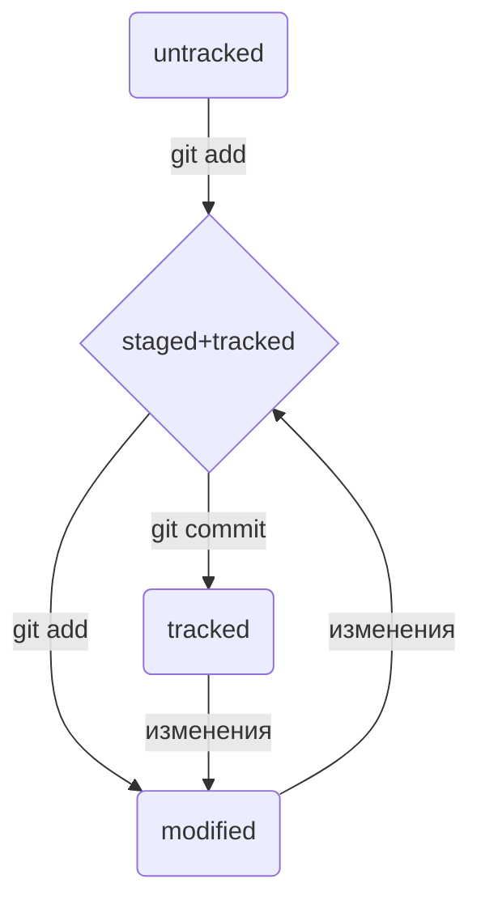
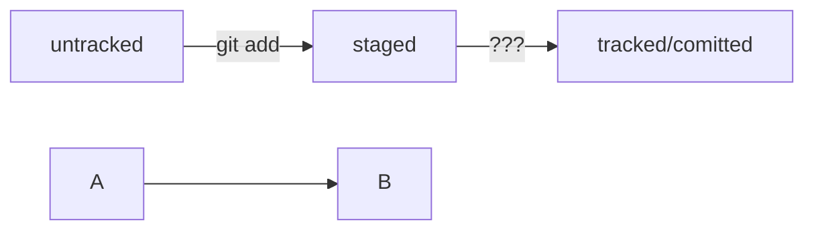

## Шпаргалка №1
### Навигация
* *pwd* (от англ. print working directory, "показать рабочую папку") -- покажи, в какой я папке
* *ls* (от англ. list directory contents, "отобразить содержимое директории") -- покажи файлы и папки в текущей папке
* *ls -a* -- покади также скрытые файлы и папки, названия которых начинаются с символа *.*
* *cd first-project/html* -- перейди в папку *html*, которая находится в папке *first-project*
* *cd ..* -- перейди на уровень выше, в родительскую папку
* *cd ~* -- перейди в домашнюю директорию (/Users/Username)
* *cd /* -- перейди в корневую директорию

### Работа с файлами и папками
* *touch index.html* (англ. touch, "коснуться") -- создать файл *index.html* в текущей папке
```
$ touch my-new-file.txt #создали файл my-new-file.txt
```
* *touch index.html style.css script.js* -- если нужно создать сразу несколько файлов, можно напечатать их имена в одну строку через пробел
* *mkdir second-project* (от англ. make directory, "создать директорию") -- создай папку с именем *second-project* в текущей папке
```
$ mkdir new-dir #создали директорию new-dir
```
```
$ mkdir -p dir1/dir-inside/dir-deeper-inside #создали папку dir-deeper-inside в папке dir-inside, которая находится в папке dir1
#Также можно использовать обе команды вместе с символом домашней директории (~) или родительской директории (..).
```
* *cp* (копировать файл)
```
$ cp что_копируем куда_копируем
```
```
$ cp index.html src/ #скопировали index.html в папку src
```

### Копирование и перемещение 
* *p file.txt ~/my-dir* (от англ. copy, "копировать") -- скопируй файл в другое место
* *mv file.txt ~/my-dir* (от англ. move, "переместить") -- перемести файл или папку в другое место

### Чтение
* *cat file.txt* (от англ. concatenate and print, "объединить и распечатать") -- распечатай содержимое файла *file.txt*
Команда напечатает, что содержится в открываемом файле
Команда cat работает только с текстовыми файлами. Вывести этой командой файл другого типа (например, изображение) не получится.

### Удаление
* *rm about.html* (от англ. remove, "удалить") -- удали файл *about.html*
```
$ rm example.txt удалили файл example.txt из текущей папки
```
* *rmdir images* (от англ. remove directory, "удали директорию") -- удали папку *images*
* *rm -r second-project* (от англ. remove, "удалить" + recursive, "рекурсивный") -- удали папку *second-project* и все, что она содержит

### Полезные возможности
* Команды необязательно печатать и выполнять по очереди. Можно указать их списком -- разделить двумя амперсандами (*&&*)
* У консоли есть собственная память -- буфер с несколькими последними командами. По ним можно перемещаться с помощью клавиш со стрелками вверх\вниз
* Чтобы не вводить название файла или папки полностью, можно набрать первые символы имени дважды нажать *TAB*. Если файл или папка есть в директории, командная строка допишет путь сама
* Например, вы находитесь в папке *dev*. Начните вводить *cd first* и дважды нажмите *TAB*. Если папка *first-project* есть внутри *dev*, командная строка автоматически подставит ее имя. Останется только нажать *Enter*

---

## Шпаргалка №2. Начало работы с Git

### Инициализация репозитория
**git init** (от англ. initialize, «инициализировать») — инициализируй репозиторий.

### Синхронизация локального и удалённого репозиториев
**git remote add origin** https://github.com/YandexPracticum/first-project.git (от англ. remote, «удалённый» + add, «добавить») — привяжи локальный репозиторий к удалённому с URL https://github.com/YandexPracticum/first-project.git;
**git remote -v** (от англ. verbose, «подробный») — проверь, что репозитории действительно связались;
**git push -u origin main** (от англ. push, «толкать») — в первый раз загрузи все коммиты из локального репозитория в удалённый с названием origin.

*Ваша ветка может называться master, а не main. Подправьте команду, если это необходимо.*

**git push** (от англ. push, «толкать») — загрузи коммиты в удалённый репозиторий после того, как он был привязан с помощью флага -u.

### Подготовка файла к коммиту
**git add todo.txt** (от англ. add, «добавить») — подготовь файл todo.txt к коммиту;
**git add --all** (от англ. add, «добавить» + all, «всё») — подготовь к коммиту сразу все файлы, в которых были изменения, и все новые файлы;
**git add** . — подготовь к коммиту текущую папку и все файлы в ней.

### Создание и публикация коммита
**git commit -m** "Комментарий к коммиту." (от англ. commit, «совершать», фиксировать» + message, «сообщение») — сделай коммит и оставь комментарий, чтобы было проще понять, какие изменения сделаны;
**git push** (от англ. push, «толкать») — добавь изменения в удалённый репозиторий.

### Просмотр информации о коммитах
**git log** (от англ. log, «журнал [записей]») — выведи подробную историю коммитов;
**git log --oneline** (от англ. log, «журнал [записей]» + oneline, «одной строкой») — покажи краткую информацию о коммитах: сокращённый хеш и сообщение.

### Просмотр состояния файлов
**git status** (от англ. status, «статус», «состояние») — покажи текущее состояние репозитория.

### Добавление изменений в последний коммит
**git commit --amend --no-edit** (от англ. amend, «исправить») — добавь изменения к последнему коммиту и оставь сообщение прежним;
**git commit --amend -m "Новое сообщение"** — измени сообщение к последнему коммиту на Новое сообщение.

*Выйти из редактора Vim: нажать Esc, ввести :qa!, нажать Enter.*

### «Откат» файлов и коммитов
**git restore --staged hello.txt** (от англ. restore, «восстановить») — переведи файл hello.txt из состояния staged обратно в untracked или modified;
**git restore hello.txt** — верни файл hello.txt к последней версии, которая была сохранена через git commit или git add;
**git reset --hard b576d89** (от англ. reset, «сброс», «обнуление» + hard, «суровый») — удали все незакоммиченные изменения из staging и «рабочей зоны» вплоть до указанного коммита.

### Просмотр изменений
**git diff** (от англ. difference, «отличие», «разница») — покажи изменения в «рабочей зоне», то есть в modified-файлах;
**git diff _a9928ab 11bada1_** — выведи разницу между двумя коммитами;
**git diff --staged** — покажи изменения, которые добавлены в staged-файлах.

---

## Шпаргалка №3. Работа с ветками

### Клонирование чужого репозитория
**git clone git@github.com:YandexPraktikum/first-project.git** (от англ. clone, «клон», «копия») — склонируй репозиторий с URL *first-project.git* из аккаунта YandexPraktikum на мой локальный компьютер.

### Создание веток
**git branch feature/the-finest-branch** (от англ. branch, «ветка») — создай ветку от текущей с названием *feature/the-finest-branch*;
**git checkout -b feature/the-finest-branch** — создай ветку feature/the-finest-branch и сразу переключись на неё.

### Навигация по веткам
**git branch** (от англ. branch, «ветка») — покажи, какие есть ветки в репозитории и в какой из них я нахожусь (текущая ветка будет отмечена символом *);
**git checkout feature/br** — переключись на ветку feature/br.

### Сравнение веток
**git diff main HEAD** (от англ. difference, «отличие», «разница») — покажи разницу между веткой main и указателем на HEAD;
**git diff HEAD~2 HEAD** — покажи разницу между тем коммитом, который был два коммита назад, и текущим.

### Удаление веток
**git branch -d br-name** — удали ветку br-name, но только если она является частью main;
**git branch -D br-name** — удали ветку br-name, даже если она не объединена с main.
### Слияние веток
**git merge main** (от англ. merge, «сливать», «поглощать») — объедини ветку main с текущей активной веткой. 

### Работа с удалённым репозиторием
**git push -u origin my-branch** (от англ. push, «толкнуть», «протолкнуть») — отправь новую ветку my-branch в удалённый репозиторий и свяжи локальную ветку с удалённой, чтобы при дополнительных коммитах можно было писать просто git push без -u;
**git push my-branch** — отправь дополнительные изменения в ветку my-branch, которая уже существует в удалённом репозитории;
**git pull** (от англ. pull, «вытянуть») — подтяни изменения текущей ветки из удалённого репозитория.

---

## Шпаргалка №4. Командная работа в Git

### Feature branch workflow
Самый популярный подход к работе с Git в команде — это feature branch workflow. В нём создают ветку для каждой задачи (например, для новой функциональности или исправления бага), а когда всё готово, вливают новую ветку в main.

Важные этапы этого процесса — пул-реквест и ревью изменений. Пул-реквест — это интерфейс, в котором можно обсудить изменения. Ревью — просмотр изменений другими участниками и один из способов проверить качество таких изменений.

Если вы уже участник проекта (или collaborator в терминах GitHub), можно клонировать репозиторий напрямую. А если нет, нужно предварительно сделать «форк». Также для участников доступна кнопка Merge после ревью, а для неучастников — нет.

### Конфликты слияния
Когда один и тот же файл меняется в нескольких ветках, при их слиянии может произойти конфликт. Пугаться конфликтов не нужно, это нормальная часть работы с системами контроля версий. IDE, вроде VSCode или Intellij IDEA, помогут «склеить» файл из двух конфликтующих версий.

### Алгоритм-шпаргалка для создания PR
1. Склонировать репозиторий.
	1.1 Если вы не участник проекта, предварительно сделать «форк» исходного репозитория.
	1.2 На странице репозитория или «форка» нажать кнопки: **Code → SSH → скопировать ссылку**.
	1.3 Выполнить команду **git clone <ссылка на репозиторий>**.
2. Создать ветку для вашей задачи: **git checkout -b my-task-branch-name**.
3. Добавить и «закоммитить» изменения, которые вы хотите внести в проект.
4. «Запушить» ветку: **git push --set-upstream origin HEAD** или **git push -u origin my-task-branch-name**.
	4.1 GitHub (с помощью Git) выведет ссылку на создание PR. По ней нужно перейти.
	4.2 PR можно также создать через интерфейс GitHub.
5. Сообщить о пул-реквесте ревьюеру.
	5.1 Иногда ревьюеры назначаются автоматически, тогда сообщать не нужно.
6. Обсуждать с ревьюером предлагаемые изменения и вносить правки, пока эти изменения не будут одобрены (пока не будет получен «апрув»).  
	6.1. Если кто-то добавил конфликтующие изменения в main, пока ваш PR был на ревью, нужно разрешить конфликт:  
		* Обновить main: **git checkout main && git pull**.
		* Влить main в свою ветку: **git checkout my-task-branch-name && git merge main**.
		* Разрешить конфликты слияния с помощью IDE или вручную.
		* Создать коммит слияния: **git commit --no-edit** или **git commit -m 'merge main'**.
		* Сделать git push своей ветки.
7. Нажать кнопку **Merge** или подождать, пока её нажмёт кто-то ещё.
8. Ещё раз обновить main, чтобы «подтянуть» ваши изменения в основную ветку локального репозитория: **git checkout main && git pull**.
9. Вы великолепны! Можете начинать снова со второго пункта.

### Алгоритм-шпаргалка для разрешения конфликтов слияния
1. Открыть проект в IDE (VS Code, IDEA или другие).
2. Открыть файл, в котором есть конфликт.
3. Выбрать, какие части файла нужно взять из одной ветки, а какие — из другой.
4. Когда конфликты разрешены, сделать коммит: **git commit --no-edit** или **git commit -m 'merge branch <название ветки>'**.

---

## gitk --all% -открыть графическую оболочку гита, чтобы позырить все коммиты

---

```
$ rmdir images #команда удалит папку images из текущей директории, 
               #если папка images пуста
$ rm -r images #удалили папку images со всем её содержимым из текущей директории
```
В этом случае команда rm -r (-r — от англ. recursive, «рекурсивный») рекурсивно удаляет файлы и папки. Это значит, что удаление будет последовательно применяться к каждому из элементов в этой папке — пока не сотрёт их все. Затем команда удалит пустую директорию.

Команды в терминале необязательно вбивать и выполнять по очереди. Их можно указывать не по одной, а сразу списком. Для этого их нужно разделить двумя амперсандами (&&).

---

```
git config –global #(изменение инфо файла с именем почтой)
```
```
$ git config --global user.name "User Namovich"
```
имя или ник нужно написать латиницей и в кавычках
```
$ git config --global user.email username@yandex.ru
```
здесь нужно указать свой настоящий email
```
$ git config –list
```
*Сделать папку репозиторием — git init*
```
$ cd ~/dev/first-project #перешли в нужную папку
$ git init #создали репозиторий
```
«Разгитить» папку, если что-то пошло не так, *— rm -rf .git*

*Проверить состояние репозитория — git status*

#### Команда git status выведет:
* название текущей ветки: On branch master или On branch main;
* сообщение о том, что в репозитории ещё нет коммитов: No commits yet;
* сообщение, которое говорит: «чтобы что-нибудь закоммитить (то есть зафиксировать), нужно сначала это создать» — nothing to commit (create/copy files and use "git add" to track).

*Подготовить файлы к сохранению — git add*

Для отслеживания состояния всех файлов: 
```
$ git add --all #(от англ. add — «добавить» + от англ. all — «всё»). Ключ, или флаг, --all позволяет подготовить к сохранению все файлы в репозитории.
$ git add --all #подготовили к сохранению все файлы в репозитории
$ git status #проверили статус
$ git add todo.txt
$ git add readme.txt
$ git status
```
Также можно добавить текущую папку целиком — в этом случае все файлы в ней тоже будут добавлены. Обратиться к текущей папке в Bash позволяет точка (.).

```
$ git add . #добавить всю текущую папку
$ git status 
```

*«Сделать коммит» значит сохранить текущую версию файла.*

Сделать коммит можно командой git commit c ключом -m (от англ. message — «сообщение»), который присваивает коммиту сообщение.
Ещё раз о разнице между git add и git commit
Сначала команда git add сообщает Git, какие именно файлы нужно сохранить и какую их версию. Затем с помощью команды git commit происходит само сохранение. 

*Просмотреть историю коммитов — git log*

```
$ ls -la .ssh/ #вывели список созданных ключей
$ ssh-keygen -t ed25519 -C "электронная почта, к которой привязан ваш аккаунт на GitHub"
$ ssh-keygen -t rsa -b 4096 -C "электронная почта, к которой привязан ваш аккаунт на GitHub"
ls -a ~/.ssh
```

---

скопировать содержимое ключа в буфер обмена:
```
$ clip < ~/.ssh/id_rsa.pub
для ed25519:
$ clip < ~/.ssh/id_ed25519.pub
```

---

*Создать репозиторий на github.com с полностью таким же названием, как и у локального репозитория*

*Привязать удалённый репозиторий к локальному — git remote add*
```
$ git remote add origin git@github.com:%ИМЯ_АККАУНТА%/first-project.git
```
origin (англ. «источник») — стандартный псевдоним, с помощью которого можно обращаться к главному удалённому репозиторию (обычно такой репозиторий один). Это значительно упрощает работу.

*Убедиться, что репозитории связаны, — git remote -v*

*Отправить изменения на удалённый репозиторий — git push*

```
$ git push -u origin main #Если команда приведёт к ошибке, попробуйте заменить main на master.
```
В дальнейшем при работе с удалённым репозиторием флаг -u можно опустить и писать просто git push.

---

## Как создать и оформить README.md

README.md — текстовый файл, который можно создать командой touch, а затем редактировать так же, как и любой другой текстовый документ. Например, в блокноте.
Маркда́ун — это специальный язык разметки. Он позволяет красиво отформатировать текстовый документ.
* Заголовки разных уровней создают решётками.
# H1 — заголовок первого уровня, самый большой
## H2 — заголовок второго уровня, поменьше
### H3
#### H4
##### H5
###### H6 — заголовок шестого уровня, самый маленький

#### Заголовок 4
* Можно добавить черту под заголовком или абзацем.
Текст над чертой

---

Текст под чертой
* Чтобы сделать разрыв строки, нужно поставить два пробела (в примере ниже они обозначены точками ⋅⋅) или сочетание символов <br>.
* Чтобы начать новый параграф, в конце предыдущей строки должно стоять два символа переноса. Для этого нужно нажать Enter два раза.
Если сделать один перенос строки, как в примере ниже, и не поставить два пробела, текст сольётся в одну строку.
* Чтобы выделить текст курсивом (*текст*), его заключают в звёздочки (астериски) или нижние подчёркивания.
* Чтобы выделить текст полужирным шрифтом (**текст**), его окружают двойными звёздочками или двойными нижними подчёркиваниями.
* Чтобы зачеркнуть текст (~~текст~~), его окружают двойными волнистыми линиями — тильдами.

* Для оформления нумерованного списка достаточно поставить в начало строки цифры с точкой.
* Ненумерованный список создаётся звёздочкой с пробелом в начале строки либо дефисом с пробелом.

* Чтобы сделать ссылкой часть текста, его заключают в квадратные скобки, а затем указывают нужный адрес в круглых скобках.
* Также можно добавить ссылке тайтл (от англ title — «название», «заголовок»). Тайтл — это всплывающая подсказка, которая появляется при наведении мыши на ссылку. Тайтл нужно заключить в кавычки и указать внутри скобок после адреса.

Чтобы оформить текст как код, нужно окружить его тройками косых кавычек — грависов. После первой тройки грависов указывают язык программирования, на котором написан код. В маркдауне есть поддержка синтаксиса почти всех популярных языков и инструментов. 
```bash
ls - la
```
```html
<h1>А я просто текст</h1>
```
Обратите внимание: вторая тройка тройных кавычек стоит на отдельной строке.

---

## Хеш — идентификатор коммита
Хеширование (от англ. hash, «рубить», «крошить», «мешанина») — это способ преобразовать набор данных и получить их «отпечаток» (англ. fingerprint).
Git хеширует (преобразует) информацию о коммите с помощью алгоритма SHA-1 (от англ. Secure Hash Algorithm — «безопасный алгоритм хеширования») и получает для каждого коммита свой уникальный хеш — результат хеширования.
* Обычно хеш — это короткая (4040 символов в случае SHA-1) строка, которая состоит из цифр 0—90—9 и латинских букв A—F (неважно, заглавных или строчных). Она обладает следующими важными свойствами:
* если хеш получить дважды для одного и того же набора входных данных, то результат будет гарантированно одинаковый;
* если хоть что-то в исходных данных поменяется (хотя бы один символ), то хеш тоже изменится (причём сильно).

* Git преобразует информацию о коммитах с помощью алгоритма SHA-1 и для каждого из них рассчитывает уникальный идентификатор — хеш.
* Хеш — основной идентификатор коммита и позволяет узнать его автора, дату и содержимое закоммиченных файлов.
* Все хеши, а также таблицу соответствий хеш → информация о коммите Git хранит в папке .git.

---

*Получить сокращённый лог — git log --oneline*
Обратите внимание: если выход из просмотра логов не произошёл автоматически, нажмите клавишу Q (от англ. Quit — «выйти») в английской раскладке клавиатуры.

---

## Статусы untracked/tracked, staged и modified
* untracked (англ. «неотслеживаемый») 
Мы говорили, что новые файлы в Git-репозитории помечаются как untracked, то есть неотслеживаемые. Git «видит», что такой файл существует, но не следит за изменениями в нём. У untracked-файла нет предыдущих версий, зафиксированных в коммитах или через команду git add. 
* staged (англ. «подготовленный»)
После выполнения команды git add файл попадает в staging area (от англ. stage — «сцена», «этап [процесса]» и area — «область»), то есть в список файлов, которые войдут в коммит. В этот момент файл находится в состоянии staged.
В одном из предыдущих уроков мы сравнили коммит с фотографией. Можно развить эту аналогию и сказать, что команда git add добавляет персонажей (текущее содержимое файла или нескольких файлов) на сцену (англ. stage) для общей фотографии, а git commit делает снимок всей сцены целиком. 

#### Staging area, index и cache
Staging area также называют index (англ. «каталог») или cache (англ. «кеш»), а состояние файла staged иногда называют indexed или cached.
Все три варианта могут встречаться в документации и в качестве флагов команд Git. А также в интернете — например, в вопросах и ответах на сайте Stack Overflow.

#### Для файлов в состояниях staged и modified обычно не указывают, что они также tracked, потому что это состояние подразумевается.

Схема изменения состояний


---

### Пример обычного графа(`mermaid не забыть)

graph LR;
  untracked -- "git add" --> staged;
  staged    -- "???"     --> tracked/comitted;

%% стрелка без текста для примера: 
  A --> B;


---

## Какие состояния показывает git status
Большинство файлов в типичном проекте будут находиться в состоянии tracked (то есть закоммичены и не изменены после коммита). Вы не увидите это состояние в выводе команды git status — иначе она бы каждый раз выводила список вообще всех файлов проекта.
В итоге git status показывает только следующие состояния файлов:
* staged (Changes to be committed в выводе git status);
* modified (Changes not staged for commit);
* untracked (Untracked files).

##### Типичные варианты вывода git status
1. Нет ни staged-, ни modified-, ни untracked-файлов.
```
$ git status
On branch master
nothing to commit, working tree clean
```
2. Найдены неотслеживаемые файлы.
```
$ touch fileA.txt
$ git status
On branch master
Untracked files: #найдены неотслеживаемые файлы
  (use "git add <file>..." to include in what will be committed)
        fileA.txt

nothing added to commit but untracked files present (use "git add" to track)
```
Файл fileA.txt отображается в секции неотслеживаемых файлов — Untracked files. Это значит, что он не был добавлен в репозиторий через git add.
Теперь fileA.txt находится в секции Changes to be committed (англ. «изменения, которые попадут в коммит»). Если сейчас выполнить коммит, то в репозитории будет зафиксирована текущая версия этого файла. Закоммитьте его.
```
$ git commit -m 'Добавить файл fileA.txt'
```

тут будет вывод комманды commit, он нас не интересует
```
$ git status
On branch master
nothing to commit, working tree clean
```
3.	Найдены изменения, которые не войдут в коммит
внесли в fileA.txt правки
запросили статус
```
$ git status
On branch master
8Changes not staged for commit: #ещё одна секция
  (use "git add <file>..." to update what will be committed)
  (use "git restore <file>..." to discard changes in working directory)
        modified:   fileA.txt
```
Файл fileA.txt был изменён, но ещё не добавлен в staging area после этого. Так он оказался в секции Changes not staged for commit (англ. «изменения, которые не подготовлены к коммиту»). Эта секция соответствует статусу modified.
```
$ git add fileA.txt
$ git status
On branch master
Changes to be committed: #все изменения готовы к коммиту
  (use "git restore --staged <file>..." to unstage)
        modified:   fileA.txt
```
Обратите внимание: хотя вывод команды git status очень похож на тот, который был после первого добавления файла fileA.txt, они всё же отличаются.
Когда совсем новый файл попадает в staging area, перед его названием указывается new file. Вот так: new file: fileA.txt.
Если файл уже однажды попадал в историю (с помощью коммита) и был изменён, после выполнения git add он будет записан уже так: modified: fileA.txt.

4.	Файл добавлен в staging area, но после этого изменён
изменили fileA.txt
```
$ git status
On branch master
Changes to be committed:
  (use "git restore --staged <file>..." to unstage)*
          modified:   fileA.txt

Changes not staged for commit:
  (use "git add <file>..." to update what will be committed)
  (use "git restore <file>..." to discard changes in working directory)
          modified:   fileA.txt*
```
Файл попал и в staged (Changes to be committed), и в modified (Changes not staged for commit). В staging area находится версия файла с одним восклицательным знаком, а в Changes not staged for commit — уже изменённая версия, с тремя.
Чтобы закоммитить самую свежую версию файла, нужно снова выполнить git add перед коммитом.

---

## ПОДХОД К ОФОРМЛЕНИЮ КОММИТОВ
#### Корпоративный
Во многих компаниях применяется **Jira** — система для организации проектов и задач. У каждой задачи в Jira есть идентификатор из нескольких заглавных латинских букв и номера. Например, LGS-239 значит, что это 239239-я задача в проекте LGS (сокращение от англ. logistics — «логистика»).
В корпоративном стиле в начале сообщения обычно указывают Jira-ID, а после — текст сообщения.
```
$ git commit -m "LGS-239: Дополнить список пасхалок новыми числами"
```
#### Conventional Commits
*Стандарт Conventional Commits* (англ. «соглашение о коммитах») отличается качественной документацией и подробной проработкой. Он подходит для репозиториев с исходным кодом программ. Использовать его для других типов проектов (например, для перевода книги) было бы неудобно.
Conventional Commits предлагает такой формат коммита: <type>: <сообщение>. Первая часть type — это тип изменений. Таких типов достаточно много. Вот два примера:
* feat (англ. «навык») — для новой функциональности;
* fix (от англ. «исправить», «устранить») — для исправленных ошибок.
```
git commit -m "feat: добавить подсчёт суммы заказов за неделю"
```

#### GitHub-стиль
GitHub можно использовать не только для хранения файлов проекта, но и для ведения списка задач (англ. issue) этого проекта. Если коммит «закрывает» или «решает» какую-то задачу, то в его сообщении удобно указывать ссылку на неё. Для этого в любом месте сообщения нужно указать #<номер задачи>. Например, вот так.
```
$ git commit -m "Исправить #334, добавить график температуры"
```

##### Инфинитив и императив
Для сообщений на русском языке часто рекомендуют использовать инфинитивы. Например: *Добавить тесты для PipkaService, Исправить ошибку #123* и так далее.
Для сообщений на английском рекомендуется использовать повелительное наклонение (англ. imperative). Например: *Use library mega_lib_300, Fix exit button* и так далее.
Эти рекомендации сложились исторически, и им следуют многие проекты.

---

## Как исправить коммит
В таком случае можно внести правки в уже сделанный коммит с помощью опции *--amend* (от англ. amend — «исправить», «дополнить») у команды commit: *git commit --amend*. Разберём, как она работает.
Важно: опция *--amend* работает только с последним коммитом (HEAD)
Дополнить коммит новыми файлами 
```
— git commit --amend --no-edit
```
Пример 
```
$ git add common.css
# добавили файл common.css в список на коммит как обычно

# но вместо команды commit -m '...'
# будет:
$ git commit --amend --no-edit
Точно так же можно добавить не новый файл, а дополнительные изменения в уже добавленном в коммит файле.
# ещё раз отредактировали main.html

$ git add main.html # добавили в список на коммит
$ git commit --amend --no-edit
```
Изменить сообщение коммита *— git commit --amend -m "Новое сообщение"*

### Случилось страшное: открылся редактор
Кстати реально страшно было: никак не закрывается, мигает, трэш…
Если забыть указать у команды *git commit --amend* один из флагов (*--no-edit* или *-m*), Git предложит отредактировать сообщение коммита вручную. Для этого он откроет текстовый редактор, который установлен в системе по умолчанию. Чаще всего это либо GNU nano, либо Vim.

---

## Как откатиться назад, если «всё сломалось»
 На разных этапах работы с Git могут происходить похожие ситуации:
* В список на коммит попал лишний файл (например, временный). Нужно «вынуть» его из списка.
* Последние несколько коммитов ошибочные: например, сделали не то, что было нужно, или нарушили логику. Хочется «откатить» сразу несколько коммитов, вернуть «как было вчера».
* Случайно изменился файл, который вообще не должен был меняться. Например, вы открыли не тот файл в редакторе и начали его исправлять.
Выполнить unstage изменений — **git restore --staged <file>**
Допустим, вы создали или изменили какой-то файл и добавили его в список «на коммит» (staging area) с помощью git add, но потом передумали включать его туда. Убрать файл из staging поможет команда **git restore --staged <file>** (от англ. restore — «восстановить»).
В терминале это будет выглядеть примерно так.
```
$ touch example.txt # создали ненужный файл
$ git add example.txt # добавили его в staged

$ git status # проверили статус
Changes to be committed:
  (use "git restore --staged <file>..." to unstage)
        new file:   example.txt

$ git restore --staged example.txt
$ git status # проверили статус

Untracked files:
  (use "git add <file>..." to include in what will be committed)
        example.txt

no changes added to commit (use "git add" and/or "git commit -a")
# файл example.txt из staged вернулся обратно в untracked
```
Чтобы «сбросить» все файлы из staged обратно в untracked/modified, можно воспользоваться командой **git restore --staged .**: она сбросит всю текущую папку (.).

«Откатить» коммит — **git reset --hard <commit hash>**
```
$ git log --oneline # хеш можно найти в истории
7b972f5 (HEAD -> master) style: добавить комментарии, расставить отступы
b576d89 feat: добавить массив Expenses и цикл для добавления трат # вот сюда и вернёмся
4b58962 refactor: разделить analyzeExpenses() на countSum() и saveExpenses()

$ git reset --hard b576d89
# теперь мы на этом коммите
HEAD is now at b576d89 feat: добавить массив Expenses и цикл для добавления трат
```

«Откатить» изменения, которые не попали ни в staging, ни в коммит, — **git restore <file>**
```
# случайно изменили файл example.txt
$ git status
On branch main
Changes not staged for commit:
  (use "git add <file>..." to update what will be committed)
  (use "git restore <file>..." to discard changes in working directory)
          modified:   example.txt

$ git restore example.txt
$ git status
On branch main
nothing to commit, working tree clean
```

---

## Просматриваем изменения в файлах
* Вы собираетесь сделать коммит, но хотите проверить (или перепроверить), какие именно изменения в него попадут.
* Вчера ваш коллега сделал коммит с сообщением small fix (англ. «небольшое исправление»), после чего тесты проекта начали «падать». Чтобы разобраться в ситуации, нужно посмотреть, что изменилось в этом коммите.
Всё это позволяет делать команда **git diff** (от англ. difference — «отличие», «разница»). О её возможностях пойдёт речь в этом и следующем уроках.

Зачем вообще указывать, какие строки файла участвуют? Разве сравниваются не все строки?
Указывается не то, какие строки сравнивались, а какие попали в вывод команды **git diff**. Это важно для больших файлов. Если, например, сравнить два файла по 10001000 строк, в которых отличается только 500500-я строка, то git diff выведет порядка 1010 строк (что-нибудь вроде @@ -495,10 +495,10 @@ — с 495495-й по 505505-ю). Иначе пришлось бы читать всю тысячу. 1010 строк вместо одной нужно, чтобы было проще понять контекст изменения.

Не волнуйтесь: изменения не потерялись. Просто по умолчанию команда git diff не показывает изменения в staged-файлах — только в *modified*.
Чтобы всё-таки просмотреть изменения в staged, нужно использовать флаг --staged: **git diff --staged**.

---

## Сопоставляем коммиты
Дописываем строку в файл
Чтобы продолжить сказку, вам нужно будет дописывать новые строки в конец файла teremok.txt. Для этого подходит команда echo (англ. «эхо»). Разберём её.
Но если скомбинировать echo с символами перенаправления вывода **>>** (два знака «больше»), то всё, что должно было попасть на экран, вместо этого будет записано в файл.
```
$ cat file.txt
Первая строка файла
```

```
$ echo "Вторая строка файла" >> file.txt
$ cat file.txt
Первая строка файла
Вторая строка файла
```

Одинарный символ > тоже перенаправит вывод команды в файл, но перед этим сотрёт содержимое файла, то есть перезапишет файл целиком.
```
$ cat file.txt
Первая строка файла
$ echo "Новая строка" > file.txt
$ cat file.txt
Новая строка
```
#### Порядок аргументов git diff
По сути команда git diff A B выводит список инструкций: как превратить состояние A в состояние B. Если поменять A и B местами (git diff B A), то и инструкции будут обратные: как превратить B в A. При этом все зелёные строки станут красными, и наоборот.

---

## Игнорирование файлов в Git
Часто бывает так, что в папке-репозитории есть файлы, для которых не нужно хранить историю изменений. Например:
* macOS иногда создаёт скрытый файл .DS_Store для хранения настроек папки. К вашему проекту он, скорее всего, никакого отношения не имеет.
* В Git не принято коммитить результаты компиляции исходного кода, то есть получившиеся исполняемые файлы.
* Среды разработки (вроде IntelliJ IDEA) могут создавать папку с вашими личными настройками проекта. Если добавить её в репозиторий, то среда разработки других участников проекта может загрузить ваши настройки и начать вести себя странно.
Чтобы Git игнорировал такие файлы и не пытался добавить их в репозиторий, нужно создать файл *.gitignore* (от англ. ignore — «игнорировать») и записать в него названия игнорируемых файлов. В этом уроке разберём, как это сделать.
Как заполнить *.gitignore*
В простейшем случае в .gitignore указывают все файлы, которые нужно игнорировать (по одному имени на строку). Но часто удобнее использовать шаблоны. Шаблон, или правило, — это способ указать сразу на несколько файлов с однотипными названиями.

💡 Правила из *.gitignore* применяются только к новым (untracked) файлам. Если файл уже попал в staging area или в коммит, то правила на него не распространяются.
Комментарий

Если строка начинается с #, то это комментарий, и .gitignore не будет его учитывать.
Просто название файла
Допустим, нужно, чтобы Git игнорировал все файлы .DS_Store. Для этого достаточно добавить в *.gitignore* строку с названием файла.

#### Звёздочка (*)
Символ звёздочки (*) соответствует любой строке, включая пустую. Если такой символ используется в шаблоне в .gitignore, значит, файл будет проигнорирован вне зависимости от того, что будет на месте звёздочки.
```
# игнорировать все файлы, которые заканчиваются на .jpeg
*.jpeg
```
```

# игнорировать все файлы "tmp" во всех подпапках папки docs
docs/*/tmp
```

#### Вопросительный знак (?)
Вопросительный знак ? соответствует одному любому символу.
file?.txt
Если сохранить такую запись в .gitignore, то будут проигнорированы, например, файлы fileA.txt и file1.txt. А вот файл file12.txt не будет проигнорирован, потому что в его названии два символа после file, а не один.

#### Квадратные скобки ([…])
Квадратные скобки, как и вопросительный знак, соответствуют одному символу. При этом символ не любой, а только из списка, который указан в скобках.
```
# игнорировать файлы file0.txt, file1.txt и file2.txt
# при этом не игнорировать file3.txt, file4.txt, ...
file[0-2].txt
```
В скобках можно либо перечислить символы ([abc]), либо задать диапазон ([a-z]).

#### Слеш (/)
Косая черта, или слеш (/), указывает на каталоги. Если шаблон в .gitignore начинается со слеша, то Git проигнорирует файлы или каталоги только в корневой директории.
```
# игнорировать todo.txt в корне репозитория
/todo.txt
```

```
# для сравнения: spam.txt будет игнорироваться во всех папках
spam.txt
```
Теперь файл todo.txt в корневом каталоге будет проигнорирован. При этом, например, файл subdir/todo.txt по-прежнему отслеживается.
Если шаблон заканчивается слешем, то правило применится только к папке.

```
# игнорировать папку build
build/
```

#### Парные звёздочки (**)
Функция парных звёздочек (**) похожа на функцию одинарной (*). Отличие в том, как они работают с вложенными папками. Двойная звёздочка может соответствовать любому количеству таких папок (в том числе нулю). Одинарная может соответствовать только одной.

```
# игнорировать файлы "docs/current/tmp", "docs/old/tmp",
# а также "docs/old/saved/a/b/c/d/tmp"
# и даже "docs/tmp", потому что ноль вложенных папок тоже подходит
docs/**/tmp
```

```
# игнорировать только "docs/current/tmp" и "docs/old/tmp"
# файл "docs/old/saved/a/b/c/d/tmp" не попадает в правило
docs/*/tmp
```

#### Восклицательный знак (!)
Любое правило в файле .gitignore можно инвертировать с помощью восклицательного знака (!).
```
# игнорировать все JPEG-файлы
*.jpeg
```

```
# но только не мем с Doge
!doge.jpeg
Пример файла .gitignore
```

Содержание .gitignore может быть таким.
```
# игнорировать все файлы в каталоге build
build/

# игнорировать все .log файлы
*.log

# не игнорировать *.log файлы в examples
# потому что это пример для документации
!examples/**/*.log 
```

#### .gitignore и git status
Игнорируемые файлы не отображаются в выводе команды git status, иначе они бы засоряли вывод.
Если всё же нужно отобразить все игнорируемые файлы, то это можно сделать с помощью ключа --ignored: git status --ignored. В таком случае в выводе git status появится раздел Ignored files.

---

## Клонируем репозиторий

Процесс копирования удалённого репозитория на локальный компьютер называется клонированием. Клонирование репозитория — обычно первое, что делает разработчик на новом месте работы. Вы сымитируете эту ситуацию в уроке.
Клонировать репозиторий — **git clone**
*Команда **git clone** автоматически связывает локальный и удалённый репозиторий. То есть если в GitHub-репозитории что-то поменяется (например, добавятся коммиты), вам не нужно будет заново клонировать его. Достаточно будет выполнить команду, которая обновит вашу копию.*

---

## Что такое Fork
*Fork (англ. «развилка», «ответвление»), или «форк», — это GitHub-операция; напрямую с Git она не связана. «Форк» создаёт копию репозитория в аккаунте GitHub. Такая копия будет полностью независима. Изменения, которые вы внесёте, не будут синхронизированы с исходным репозиторием.*
Применяем Fork
💡 «Форк» или clone?
Обычно комбинация «форк» + clone используется для внесения изменений в публичные репозитории. В этом случае «форк» становится подготовительным этапом перед клонированием чужого репозитория на ваш компьютер.
Если репозиторий приватный или это репозиторий вашей компании, при работе с ним достаточно clone.

---

*.sh – исполняемые скрипты. Сделать файл исполняемым, а затем исполнить его можно с помощью набора команд.*
```
$ chmod +x check.sh # эта команда сделает файл исполняемым
$ ./check.sh # эта команда исполнит скрипт
```

---

## Что такое ветка
*Ветка (англ. branch) — это изолированный поток разработки проекта. В таком потоке можно проверять разные идеи, тестировать новую функциональность и так далее.*
Ветки позволяют экспериментировать с проектом в Git, но при этом сохранять репозиторий в стабильном состоянии. Каждый член команды может работать в своей ветке и не мешать другим: коммиты, которые он сделает, не будут видны из других веток. А когда работа будет доделана, ветки можно соединить.
Ветки полезны, даже если вы работаете в одиночку — например, над сайтом. Прежде чем писать новую функциональность, для неё следует создать отдельную ветку. Также ветки позволяют одному человеку переключаться между несколькими задачами сразу.
Просмотреть ветки проекта — **git branch**
* Благодаря веткам несколько человек могут работать над одним репозиторием и не мешать друг другу. А ещё ветки помогают декомпозировать большую и страшную задачу на маленькие и понятные.
* Основная версия проекта хранится в главной ветке main (или master).

---

## Создаём ветку
Создать ветку — **git branch <название_ветки>**

#### В названии ветки есть слеш — что это значит?
Название ветки в Git может состоять из букв, цифр, а также включать любой из четырёх символов: *., -, _, /*. Эти символы не несут особого смысла. Например, ветка *feature/add-branch-info* могла бы называться *feature_add-branch-info* или *feature-add-branch*. Обратите внимание, что ветки не образуют иерархии, как директории, разделённые символом /.

### Как назвать новую ветку
Есть разные подходы к наименованию веток. Каждая команда разработки выбирает свой. Но независимо от подхода ветки нужно называть так, чтобы другим участникам было понятно, что в них происходит.
Мы будем использовать указатели **feature** (англ. «особенность», «деталь») для веток, где прорабатывается новая функциональность, и bugfix (от англ. bug — «жук», «ошибка» и fix — «исправить») для веток, где ведётся работа по исправлению ошибок.
После ключевого слова идёт слеш и описание проблемы или задачи (например, **/add-branch-info**). Это описание не должно содержать пробелов — следует использовать нижнее подчёркивание или дефис. В наших примерах мы будем использовать дефис.

---

## Шагаем с ветки на ветку
Переключиться на другую ветку — **git checkout <название_ветки>**
Создать ветку и сразу переключиться на неё — **git checkout -b <название_ветки>**

### Сравниваем ветки
Сравнить ветки — **git diff <название_ветки1> <название_ветки2>*

```
$ git diff main feature/diff # сравнили ветки main и feature/diff

diff --git a/README.md b/README.md
index 86b1ff4..fff4920 100644
--- a/README.md
+++ b/README.md
@@ -1,3 +1,5 @@
 # Ветки в Git 
 
Чтобы посмотреть все активные ветки в проекте, нужно вызвать команду `git branch` без аргументов.
+
+Для сравнения веток есть команда `git diff`.
```

```
$ git diff main 2ea56ab
# вывод будет такой же, как при использовании git diff main feature/diff
```
Вывод будет такой же, как после выполнения команды **git diff main feature/diff**. Когда вы вызываете **git diff <название_ветки1> <название_ветки2>**, Git находит два коммита, на которые указывает каждая из веток, и сравнивает их. Также с веткой можно сравнивать указатель *HEAD*.

### Суффикс навигации ~
Для облегчения этой задачи в Git есть суффикс навигации **~N**, где N — это число. Он отсчитывает от заданного коммита N коммитов назад во времени. Нумерация начинается с нуля: *commit~0* — это сам коммит, *commit~1* — предыдущий, *commit~2* — предшествующий предыдущему и так далее.
Например, *HEAD~1* — это следующий за текущим коммит. А *main~5* — это пятый коммит в ветке main, если считать с последнего выполненного коммита.
На практике чаще нужен либо текущий коммит *(HEAD)*, либо следующий за ним *(HEAD~1)*. Для *~1* есть специальное сокращение *~* (без числа). То есть вместо *HEAD~1* обычно пишут просто *HEAD~*.

---

## Объединяем и удаляем ветки
Выполнить слияние — **git merge <название_ветки>**
*Fast-forward — это режим слияния. Fast-forward (англ. «перемотка») значит, что итогом слияния будет линейная история коммитов. Такое происходит, когда истории двух веток находятся на одной прямой — то есть когда одна ветка продолжает историю, начатую другой, как в нашем примере.*

Удалить ветку после объединения — **git branch -D <название_ветки>**
У команды *git branch -D* есть более безопасный вариант с флагом *-d*. Он удалит ветку только если она была полностью объединена с другой — то есть если две ветки стали (или изначально были) частью одной истории. Например, если вы нечаянно создали ветку с неправильным названием, её можно удалить через *git branch -d %имя_ветки%*.
*Удаление локальной ветки через Git не удаляет ветку на GitHub!*

---

## Что такое конфликт
Когда сразу несколько членов команды работают над одним и тем же фрагментом проекта в разных ветках, при слиянии могут происходить конфликты. Рассмотрим, как это бывает и что делать в такой ситуации.
Как разрешать конфликты: общие рекомендации
Во время слияния Git сам подсвечивает файлы, которые не смог объединить. Чтобы разобраться в ситуации, нужно сделать следующее:
1.	Заглянуть в файл, где произошёл конфликт.
2.	Изучить обе стороны конфликта — вашу версию и версию вашего коллеги. Ваша задача — правильно собрать две версии в итоговую, так чтобы изменения обеих сторон не потерялись. Новая версия станет текущей актуальной.
3.	Вручную удалить или подправить неактуальные изменения, если они есть.
4.	Подготовить изменения к сохранению и сделать коммит.

---

## Отправить локальную ветку в удалённый репозиторий — git push
```
$ git remote add origin git@github.com:akhmatstrong/git-brnaches.git #связываем локальный и удаленный репозитории (на github)
$ git push -u origin main #применяем изменения
```
Вернитесь в локальный проект. Чтобы отправить feature/merge-request в удалённый репозиторий, необходимо ещё раз выполнить команду push.
```
$ git push -u origin feature/merge-request
```

---

## Создаём pull request
Для этого используют механизм pull request (англ. «запрос на изменения»; буквально: «запрос на подтягивание»). В обиходе его обычно так и называют — «пул-реквест», или ещё короче — ПР или PR. Алгоритм такой:
1.	Вы трудитесь над задачей в своей ветке — например, пишете код новой функциональности.
2.	Вы заканчиваете работу, а затем создаёте пул-реквест.
3.	Ваши коллеги проверяют, что код выглядит аккуратно и лаконично, а программа работает корректно; также оставляют комментарии. Этот процесс называют code review (англ. «рассмотрение кода»), или просто ревью.
4.	После финального согласования вы заливаете свою ветку в основную.

У каждого пул-реквеста есть:
* Название — краткое описание предлагаемых изменений. Например: Адаптивный заголовок сайта, Замена альбома на галерею и так далее.
* Описание — развёрнутое описание изменений. Это поле заполнять необязательно, но желательно.
* Исходная ветка — та, в которой вы работали. Например, feature/merge-request.
* Целевая ветка — основная ветка проекта, в которую вы хотите внести изменения.

Также у каждого пул-реквеста может быть два исхода:
* merge (англ. «соединить») — предлагаемые изменения приняты; код вливается в целевую ветку; пул-реквест закрывается.
* close (англ. «закрыть») — пул-реквест закрывается без слияния изменений.

### Делаем pull request
**Первый способ.** При создании новой ветки в удалённом репозитории Git распечатает сообщение. Оно включает ссылку на создание пул-реквеста.
```
remote: Create a pull request for 'feat/diff' on GitHub by visiting:
remote:      https://github.com/%ВАШ_АККАУНТ%/git-branches/pull/new/feature/merge-request
```
**Второй способ.** Чтобы создать пул-реквест для любой существующей ветки на GitHub, перейдите на страницу репозитория, а затем выберите вкладку Pull requests в верхней части экрана.
Нажмите на зелёную кнопку **New pull request** (англ. «новый запрос на изменения»).
*Вы можете создать пул-реквест из любой ветки, которая отличается от main. У многих команд разработки две основные ветки. В ветке dev ведётся вся активная работа, а в ветке main хранится основная рабочая версия. При этом ветка dev время от времени сливается с веткой main.*

---

## Забрать изменения из удалённого репозитория — git pull
Чтобы скачать изменения из удалённого репозитория, следует выполнить команду *git pull* (от англ. pull — «вытянуть») — стянуть, или «запулить» изменения.
Алгоритм такой. Сначала нужно перейти в локальный репозиторий и убедиться, что вы находитесь в правильной ветке, — как правило, это основная ветка main (или master). Затем можно ввести команду.
```
$ git checkout main # перешли в main
$ git pull # подтянули новые изменения в main
$ git checkout my-branch # вернулись в рабочую ветку my-branch
$ git merge main # влили main в новую ветку my-branch
$ git push -u origin my-branch # отправили ветку my-branch в удалённый репозиторий
```

---

## Fast-forward
Можно ли отключить fast-forward
Fast-forward слияние веток можно отключить флагом **--no-ff**. Например: **git merge --no-ff add-docs**. Также его можно отключить «навсегда» (до тех пор, пока вы не вернёте настройку «как было») с помощью настройки merge.ff: **git config [--global] merge.ff false**.
Если отключить слияние в режиме fast-forward, вместо «перемотки» ветки Git создаст в ней коммит слияния (англ. **merge commit**) — в обиходе его называют *merge-коммит* или *мёрж-коммит*. В этом случае результат «вливания» ветки add-docs в main выглядел бы так.
```
# находимся в ветке main
# --no-edit отключает ввод сообщения для merge-коммита
# --no-ff отключает fast-forward слияние веток
$ git merge --no-edit --no-ff add-docs
Merge made by the 'ort' strategy.
 docs.txt | 1 +
 1 file changed, 1 insertion(+)
 create mode 100644 docs.txt
```
```
# с флагом --graph
# Git нарисует ветки с помощью «палочек» и «звёздочек»
# получившийся коммит слияния: 6814789
$ git log --graph --oneline
*   6814789 (HEAD -> main) Merge branch 'add-docs'
|\
| * e08fa2a (add-docs) New docs 2
| * fd588b2 New docs 1
|/
* 997d9ce Commit 4
* 0313e8e Commit 3
* 5848aba Commit 2
* 04923d7 Commit 1
```
#### Зачем отключать fast-forward?
Многие проекты отключают *fast-forward* слияние веток, потому что при нём теряется часть информации. Результат выглядит так, как будто в *main* «просто появились» новые коммиты. Если не знать о ветке *add-docs*, то можно подумать, что такой ветки и не было.
Полноценный коммит слияния сохраняет всю информацию: в нём будет указано, какая именно ветка вливалась в main.

## Non-fast-forward
При слиянии не-fast-forward веток Git создаёт коммит слияния.
```
# находимся в ветке main
# --no-edit избавляет от необходимости
# вводить сообщение для merge-коммита
$ git merge --no-edit add-docs
Merge made by the 'ort' strategy.
 docs.txt | 1 +
 1 file changed, 1 insertion(+)
 create mode 100644 docs.txt
```
```
# коммит слияния: 34f5f8f
$ git log --graph --oneline
*   34f5f8f (HEAD -> main) Merge branch 'add-docs'
|\
| * 8de42eb (add-docs) New docs 2
| * 4d3c346 New docs 1
* | 15d3f04 Commit 5
|/
* 73def1e Commit 4
* 9c30ab3 Commit 3
* 83cc5ec Commit 2
* 8e87fb2 Commit 1
```
* Чаще всего сообщения к коммитам слияния не редактируют и оставляют «как предложил Git». Для таких случаев удобен флаг --no-edit: **git merge --no-edit %another_branch%**.

---

## Пара слов о rebase
В Git можно решить проблему «разошедшихся» веток с помощью операции **rebase** (англ. «перебазирование»). Эта операция позволяет изменить точку (коммит), от которой отделилась ветка.
После такого перебазирования ветки будут в состоянии *fast-forward*, и **git push** сработает без ошибок. Однако у такого шага могут быть последствия.
Например:
* могут возникать конфликты между изменениями, как при слиянии веток;
* если действовать неаккуратно, можно «сломать» репозиторий.
* Пара слов о **git push --force**
Есть и другой способ справиться с ошибкой rejected: *non-fast-forward* — это форсированный пуш. Чтобы его выполнить, используют флаг **--force** (англ. «сила», «заставить»).

---

## Почему бы не «пушить» всё в main	
В самом простом случае человек трудится над проектом в одиночку. Тогда ему, скорее всего, не понадобятся дополнительные ветки: он может «коммитить» и «пушить» всё в *main* и не усложнять.
Но если над проектом работает команда из нескольких человек, то подход «просто „запушить“ всё в main» перестаёт быть удобным.
И вот почему:
* Новым сотрудникам нужно время, чтобы влиться в рабочий процесс. Если сотрудник недавно присоединился к проекту, он может сделать что-нибудь не так, как принято, просто потому, что ещё не освоился. Если дать ему возможность выполнять **git push** прямо в main, он может «запушить» что-то не то.
* Команда git push ожидает, что обновление ветки будет происходить в режиме *fast-forward*. Добиться этого при активной работе нескольких человек с одной веткой сложно. Разберём подробнее, почему так происходит.

---

## Модели веток. Простая feature branch модель
Подходы к работе с ветками — это правила, которые описывают, когда и для чего создаются ветки, какие в них коммиты и в какой момент происходит слияние веток.
**Подходы:**
Рассмотрим три самых популярных подхода — их также принято называть *workflow* (англ. «рабочий процесс») или сокращённо: *flow*.
* **Feature branch workflow** — простой и самый популярный вариант. Если коротко, в нём для каждого нового изменения создаётся новая ветка, которая позже вливается в *main* с помощью git merge.
* **Git flow** — более сложный вариант. Подход похож на *feature branch workflow*, но в нём создаётся больше веток, а изменения (коммиты) делят на разные типы: исправление, новая функциональность и так далее. Разные типы коммитов попадают в разные ветки.
* **Trunk-based** — популярный в больших компаниях (таких как Яндекс, Google и прочих) подход, который обещает бо́льшую скорость работы в крупных командах. Этот подход тоже похож на *feature branch workflow*. Главное отличие в том, что участники проекта вливают (merge) свой код в основную ветку максимально часто. Например, каждый день.

#### Feature branch workflow
Основная идея модели *feature branch workflow* (от англ. feature — «особенность», «деталь») в том, что работа над любой новой функциональностью или исправлением ведётся в отдельной ветке.
Допустим, у вас есть задача добавить большую оранжевую кнопку. Тогда вам нужно будет создать ветку feature/add-big-orange-button. Ветка может называться и по-другому — главное, чтобы это была отдельная ветка под конкретную задачу. Все коммиты, которые относятся к созданию кнопки, попадают в эту ветку. Когда кнопка полностью готова, ветка feature/add-big-orange-button вливается (merge) в ветку main.
Подход *feature branch workflow* позволяет разработчикам трудиться над новыми функциональностями (или фичами) независимо друг от друга и не затрагивать основную ветку кода в процессе. Так как каждый работает над своей веткой самостоятельно, не возникает проблемы «расходящейся» общей ветки, которую мы описали в прошлом уроке.
При таком подходе все коммиты в ветке main — это коммиты слияния (feature-ветки вливаются в main).
Если аккуратно следовать подходу *feature branch workflow*, то:
* Не будет проблемы «расхождения» веток, ведь новые изменения попадают в main через git merge, а не через git push. Команду merge «разошедшиеся» ветки не смущают, ведь для них она и придумана.
* В ветке main всегда рабочая версия проекта. Все «полуфабрикаты» и недоделанные функциональности находятся в feature-ветках, пока не будут готовы попасть в main.

---

## Pull request и code review

### Pull (или merge) request
В большинстве команд новые функциональности и исправления попадают в main через запрос на слияние (англ. pull request, или merge request). Его так и называют — **пул-реквест** или **мёрж-реквест**. В переводе с языка Git это значит: «Вот моя ветка, хочу «вмёржить» её в main».
На этапе пул-реквеста можно сделать разные проверки:
* запустить автоматические тесты, которые покажут, не «сломают» ли новые изменения уже существующую в проекте логику;
* просмотреть изменения «глазами» — это называется **code review** (англ. «осмотр», «рецензия кода») или просто **review**. Мы будем использовать вариант написания «ревью».

### Ревью
Многие команды уделяют особое внимание процессу ревью, потому что оно выполняет сразу две важные функции:
* проверяется качество и необходимость предлагаемых изменений;
* те, кто выполняет ревью, узнают подробности о новых изменениях в проекте.

Для оценки качества изменений выделяют такие критерии:
* стиль изменений (стиль кода) совпадает с принятым в проекте;
* нет очевидных проблем — ошибок, или багов (от англ. bug, «жук»), а также уязвимостей — так называемых «дырок», через которые можно взломать систему;
* нет ничего лишнего — иногда опытный участник знает, как сделать то же самое проще, чем предлагается в пул-реквесте.

В процессе ревью можно и нужно обсуждать предлагаемые изменения. Например, можно задать вопрос: «Почему это сделано именно так?». Ответ может быть полезен как опытному участнику проекта — он поймёт замысел автора фичи, так и неопытному — он сможет научиться чему-то новому. В итоге ревью ценно не только для того, кто «принёс» изменения, но и для того, кто их просматривает.
Если ревьюеров всё устраивает, они нажимают кнопку *Approve* (англ. «согласовать», «одобрить»). Иногда вместо кнопки используется комментарий-аббревиатура *LGTM* (англ. **L**ooks **G**ood **T**o **M**e — «на мой взгляд, всё хорошо»).
После одобрения пул-реквеста его автор (или один из участников проекта) может нажать кнопку **Merge**. Тогда GitHub (или GitLab/BitBucket) вольёт feature-ветку в main. В зависимости от настроек система также предложит удалить саму feature-ветку, потому что она уже не нужна: все изменения есть в main после слияния.

В реальных проектах перед «отделением» feature-ветки стоит обновлять локальную ветку **main** (**git checkout main && git pull**), чтобы ваша ветка «росла» от последнего коммита основной. Так вы уменьшите вероятность конфликтов слияния в будущем, когда будете вливать вашу ветку обратно в *main*.
Чтобы связать локальную ветку с удалённой, мы использовали команду **git push --set-upstream origin HEAD**. Флаг **--set-upstream** — это «полная», или «длинная», версия флага **-u**. А **HEAD** здесь — это синоним **main**. С тем же результатом можно было бы выполнить команду **git push -u origin main**.

---

## Работа с PR: soft skills
Навыки специалиста принято делить на две группы: **hard skills** (англ. «жёсткие навыки») и **soft skills** (англ. «мягкие навыки», «гибкие навыки»).
* **Hard skills**, или **хардскилы**, — это владение инструментами, причём неважно какими. Умение забивать гвозди молотком, знание команд Git, умение играть на пианино — всё это примеры хардскилов. Именно этому типу навыков мы уделяли больше внимания в нашем курсе.
* **Soft skills**, или **софтскилы**, — это социально-психологические навыки. Например: умение договариваться, умение внятно донести свои мысли или понять идеи собеседника, умение мягко преподнести критику результатов работы.

Важно помнить про конечную цель любого пул-реквеста: внести в проект полезные изменения:
* При обсуждении PR старайтесь вносить конструктивные предложения, не стесняйтесь задавать уточняющие вопросы или просить ссылки на практики и примеры.
* Будьте гибки. Одна из целей ревью — сделать код понятным и привести его к стандартам конкретной команды. Иногда вам может показаться, что эти стандарты противоречат вашим знаниям о правильной реализации чего-либо.
* Обращайте внимание как на свой стиль общения, так и на стиль общения других участников. Если вы считаете, что тон комментариев коллег неприемлем, не бойтесь сказать об этом.

#### С точки зрения ревьюера
В ходе ревью ревьюеру важно не только показать техническое мастерство, но и проявить свои социально-психологические навыки.
* Ревьюер должен уметь выражать мысли понятно и вежливо, чтобы не вызвать у автора пул-реквеста неприятных эмоций. Многим людям свойственно чувствительно относиться к критике результата своего труда.
* В процессе ревью может понадобиться отклонить часть кода, которую написал разработчик. Важно уметь объяснить, почему это необходимо, а также предложить альтернативное решение. Критика должна применяться исключительно к предлагаемым изменениям, а не к личности их автора.
* Ревьюер должен помнить, что его задача — помочь улучшить качество кода, а не унизить разработчика или показать своё интеллектуальное превосходство. Умение договариваться и слушать собеседника — важные инструменты, которые в этом помогут.
* Ревьюер должен быть готов искать компромиссы, а также вести себя профессионально и уважительно в любой ситуации.

#### С точки зрения автора пул-реквеста
Автору пул-реквеста не менее, чем ревьюеру, важно развивать и применять софтскилы. Ревьюеры тратят время и усилия, чтобы помочь автору улучшить его код. Поэтому постарайтесь подготовить свой пул-реквест так, чтобы его было легко понять и принять.
* Прежде чем создать пул-реквест, убедитесь, что вы сделали всё необходимое, чтобы подготовить его к ревью. Ещё раз просмотрите изменения самостоятельно, а также проверьте сообщения к коммитам. Также, например, если ваши правки не прошли автотесты, отправлять код на ревью не имеет смысла: ревьюер не примет его.
* Когда вы отправляете пул-реквест, дайте ревьюеру достаточно времени на его изучение. Будьте готовы ответить на любые вопросы, которые могут возникнуть во время ревью.
* Не забывайте, что ревьюеры тоже могут ошибаться. Если вы считаете, что ревьюер неправильно понял ваш код или ваше решение, не бойтесь объяснить свою позицию и предоставить дополнительную информацию.

---

## Разрешение конфликта вручную и через vimdiff
**Вручную:**
Git разметил файл. Получившиеся секции содержат изменения из каждой ветки:
* Текст между <<<<<<< HEAD и ======= указывает на изменения, которые находятся в HEAD — в данном случае это ветка main. Здесь окажутся только те строки, в которых есть конфликт.
* Текст между ======= и >>>>>>> br2 показывает на изменения, которые находятся в ветке br2.
Чтобы разрешить конфликт вручную, нужно открыть файл и выбрать, какие изменения оставить, а какие отбросить. Для этого следует удалить все маркеры и ненужные изменения и оставить нужные. После разрешения конфликта файлы будут отмечены как решённые. Можно продолжить процесс слияния или выполнить коммит изменений.

```
$ cat readme.md   

<<<<<<< HEAD
version 1
=======
version 2
>>>>>>> br2
```

## Разрешаем конфликт через инструмент слияния vimdiff
В ходе курса вы наверняка не раз сталкивались с редактором Vim в консоли. Он также предоставляет инструмент слияния, который называется vimdiff. Чтобы его вызвать, при возникновении конфликта нужно выполнить команду **git mergetool**.

## Разрешение конфликта через Visual Studio Code
Такие интерфейсы предлагают почти все современные среды разработки (англ. **Integrated Development Environment**, или **IDE**, «интегрированная среда разработки») — программы, в которых собраны инструменты для быстрой и эффективной работы над проектом.
* **Accept Current Change** (англ. «принять текущие изменения») — разрешить конфликт через изменения, которые были раньше. В нашем примере эта кнопка оставит строку version 1 и удалит всё остальное.
* **Accept Incoming Change** (англ. «принять входящие изменения») — разрешить конфликт через изменения, которые внесли вы.
* **Accept Both Changes** (англ. «принять все изменения») — добавить оба изменения одно за другим.
Это удобно, если изменений немного. На случай, если таких изменений больше, у VS Code есть более мощный графический интерфейс для конфликтов. Чтобы его открыть, нажмите на кнопку Resolve in **Merge Editor** (англ. «разрешить в редакторе слияний») в правом нижнем углу экрана.

---

## Что делать, если основная ветка «убежала» вперёд в процессе ревью
Разрешить конфликт можно так:
1.	Перейти в ветку main.
2.	Загрузить новые изменения из неё с помощью **git pull**. При этом вы также загрузите ветку вашего коллеги.
3.	Снова перейти в вашу ветку **feature/my-new-awesome-code**.
4.	Выполнить **git merge main** и разрешить конфликт локально. В результате будет создан локальный коммит слияния.
5.	Отправить изменения из вашей ветки в репозиторий с помощью **git push**. Так коммит слияния попадёт в удалённый репозиторий и в пул-реквест.
Теперь, когда ваши изменения пройдут ревью и окажутся в main, удалённый и локальный репозитории будут выглядеть так.
